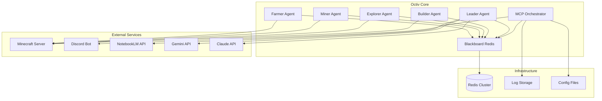
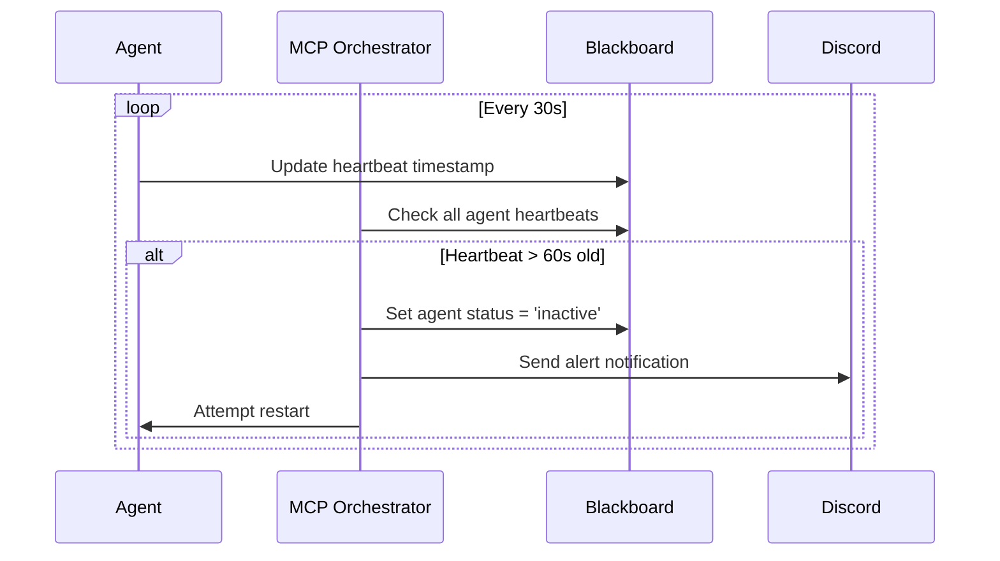
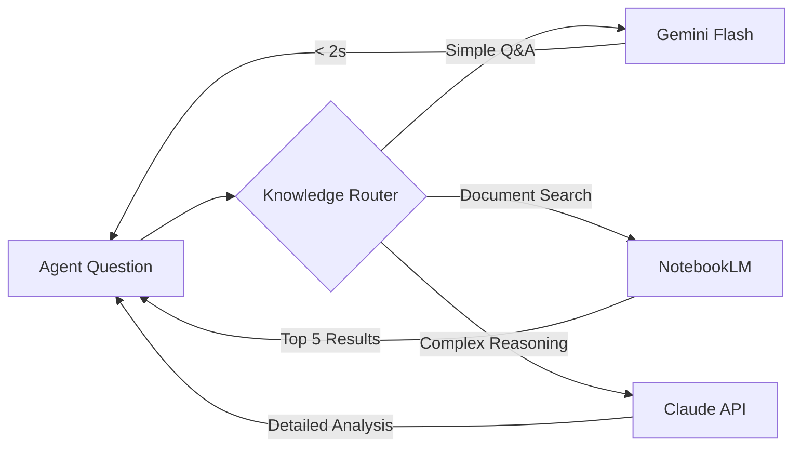

# Design Document: Octiv Next Milestone

## Overview

이 설계는 Octiv 프로젝트의 다음 마일스톤을 위한 기술적 구현 방안을 정의합니다. 현재 92% 완성도에서 안정성 확보, Live Operations 완료, 그리고 핵심 기능 구현을 통해 장기 운영 가능한 자율 AI 에이전트 팀 시스템으로 발전시키는 것이 목표입니다.

### Design Goals

1. **Test Suite Stability**: 99.7% 테스트 통과율 달성 (1384/1388)
2. **Production Readiness**: 문서화, 모니터링, 에러 처리 강화
3. **Knowledge Integration**: NotebookLM 및 Gemini API 통합으로 에이전트 지능 향상
4. **Infrastructure Expansion**: 멀티 서버 지원 및 KubeJS 플러그인 시스템
5. **Collaboration Protocol**: Claude와 Anti-Gravity 간 협업 워크플로우 확립

### Key Principles

- **Test-Driven Development**: 모든 기능은 테스트 먼저 작성 (Red-Green-Refactor)
- **Property-Based Testing**: 범용 속성 검증으로 엣지 케이스 자동 발견
- **Incremental Delivery**: 우선순위별 단계적 구현
- **Backward Compatibility**: 기존 9-agent 시스템과 완전 호환

## Architecture

### System Context



### Component Architecture

#### 1. Test Infrastructure Layer

**Purpose**: 테스트 안정성 확보 및 CI/CD 파이프라인 구축

**Components**:
- `test/builder-shelter.test.js`: 3x3x3 쉘터 구조 검증 (수정)
- `test/isolated-vm-sandbox.test.js`: Node.js v25 호환성 검증 (수정)
- `test/team-orchestrator-integration.test.js`: 에이전트 등록/작업 할당 검증 (수정)
- `test/e2e-survival.test.js`: AC-1~4 통합 검증 (신규)

**Design Decisions**:
- 기존 테스트 수정 시 하위 호환성 유지
- Property-based testing 도입으로 엣지 케이스 자동 발견
- 테스트 실행 시간 30초 이내 유지 (병렬 실행 최적화)

#### 2. Documentation & Configuration Layer

**Purpose**: 운영 환경 설정 및 배포 가이드 제공

**Components**:
- `README.md`: Node.js 호환성, isolated-vm 설치 요구사항 추가
- `config/discord.json.example`: Discord 봇 설정 템플릿
- `.env.example`: 환경 변수 가이드
- `docs/collaboration.md`: Anti-Gravity 협업 프로토콜 (신규)

**Design Decisions**:
- 설정 파일은 `.example` 접미사로 버전 관리
- 민감 정보는 환경 변수로 분리
- 다국어 문서 지원 (한국어/영어)

#### 3. Health Monitoring Layer

**Purpose**: 에이전트 생존 상태 실시간 검증 및 장애 대응

**Components**:
- `agent/heartbeat-validator.js`: Heartbeat 검증 로직 (신규)
- `agent/mcp-orchestrator.js`: Heartbeat 타임스탬프 기록 (수정)
- `agent/discord-bot.js`: 장애 알림 전송 (수정)

**Design Decisions**:
- Heartbeat 주기: 30초 (검증), 60초 (타임아웃)
- Blackboard 키: `agents:heartbeat:{agentId}`
- 장애 감지 시 Discord 알림 + 자동 재시작 시도



#### 4. Inventory Management Layer

**Purpose**: 아이템 추적 및 자원 관리 자동화

**Components**:
- `agent/inventory-tracker.js`: 실시간 인벤토리 상태 추적 (신규)
- `agent/builder.js`: 제작 시 자원 소비 추적 (수정)
- `agent/blackboard.js`: 인벤토리 데이터 게시 (수정)

**Design Decisions**:
- Blackboard 키: `agent:{id}:inventory`
- JSON 형식: `{ "oak_log": 16, "oak_planks": 64, "wooden_pickaxe": 1 }`
- 자원 부족 시 자동 수집 트리거

```javascript
// Inventory data structure
{
  "agentId": "builder-01",
  "timestamp": 1234567890,
  "items": {
    "oak_log": { "count": 16, "slot": 0 },
    "oak_planks": { "count": 64, "slot": 1 },
    "wooden_pickaxe": { "count": 1, "slot": 2, "durability": 59 }
  },
  "capacity": 36,
  "used": 3
}
```

#### 5. E2E Testing Layer

**Purpose**: AC-1~4 통합 검증 및 첫날 생존 시나리오 완성도 확인

**Components**:
- `test/e2e-survival.test.js`: 통합 테스트 스위트 (신규)
- `scripts/e2e-runner.js`: 테스트 실행 및 리포트 생성 (신규)

**Design Decisions**:
- 테스트 타임아웃: 1200 틱 (10분)
- 검증 항목: AC-1 (16 원목), AC-2 (3x3x3 쉘터), AC-3 (도구 제작), AC-4 (집결)
- 결과 리포트: `logs/e2e-{timestamp}.json`

#### 6. Performance Optimization Layer

**Purpose**: 경로 탐색 성능 최적화 및 병목 제거

**Components**:
- `agent/pathfinding-queue.js`: 비동기 경로 탐색 큐 (신규)
- `agent/builder-navigation.js`: 동적 타임아웃 조정 (수정)
- `agent/performance-metrics.js`: 성능 메트릭 수집 (신규)

**Design Decisions**:
- 큐 방식: FIFO (First In First Out)
- 타임아웃 공식: `baseTimeout + (distance / 50) * 30000ms`
- 실패 시 대체 경로 시도 (최대 3회)
- 메트릭: 시간, 거리, 성공률

```javascript
// Pathfinding queue structure
class PathfindingQueue {
  constructor() {
    this.queue = [];
    this.processing = false;
  }
  
  async enqueue(goal, options) {
    return new Promise((resolve, reject) => {
      this.queue.push({ goal, options, resolve, reject });
      this.process();
    });
  }
  
  async process() {
    if (this.processing || this.queue.length === 0) return;
    this.processing = true;
    
    const { goal, options, resolve, reject } = this.queue.shift();
    try {
      const result = await this.bot.pathfinder.goto(goal, options);
      resolve(result);
    } catch (err) {
      reject(err);
    } finally {
      this.processing = false;
      this.process(); // Process next
    }
  }
}
```

#### 7. Knowledge Integration Layer

**Purpose**: NotebookLM 및 Gemini API 통합으로 에이전트 의사결정 지원

**Components**:
- `agent/notebooklm-mcp.js`: NotebookLM MCP 서버 (신규)
- `agent/gemini-client.js`: Gemini API 클라이언트 (신규)
- `agent/knowledge-router.js`: 질문 라우팅 로직 (신규)

**Design Decisions**:
- NotebookLM: 기술 문서 검색, 프로젝트 진행 상황 동기화
- Gemini Flash: 빠른 Q&A (2초 이내 응답)
- Claude API: 복잡한 추론 (폴백)
- 비용 한도: $1.00/day



**NotebookLM MCP Tools**:
- `searchDocs(query)`: 문서 검색 (관련성 점수 포함)
- `syncProgress(acData)`: 프로젝트 진행 상황 동기화

**Gemini API Integration**:
- Model: `gemini-1.5-flash`
- Rate Limit: 60 requests/minute
- Cost Tracking: Redis 카운터 (`gemini:daily_cost`)

#### 8. Multi-Server Infrastructure Layer

**Purpose**: 여러 Minecraft 서버 동시 관리 및 로드 밸런싱

**Components**:
- `agent/server-manager.js`: 서버 연결 관리 (신규)
- `config/servers.json`: 서버 목록 설정 (신규)
- `agent/load-balancer.js`: 에이전트 분산 로직 (신규)

**Design Decisions**:
- 서버 상태: `online`, `offline`, `maintenance`
- 폴백 전략: 순차적 시도 (우선순위 기반)
- 로드 밸런싱: 에이전트 수 기반 분산

```json
// config/servers.json
{
  "servers": [
    {
      "id": "main",
      "host": "localhost",
      "port": 25565,
      "priority": 1,
      "maxAgents": 9
    },
    {
      "id": "test",
      "host": "test.example.com",
      "port": 25566,
      "priority": 2,
      "maxAgents": 5
    }
  ]
}
```

#### 9. KubeJS Plugin System Layer

**Purpose**: Minecraft 서버 동작 커스터마이징 및 에이전트 작업 최적화

**Components**:
- `server/kubejs/server_scripts/agent_events.js`: 에이전트 이벤트 핸들러 (신규)
- `server/kubejs/server_scripts/rewards.js`: 작업 완료 보상 시스템 (신규)
- `server/kubejs/startup_scripts/init.js`: 초기화 스크립트 (신규)

**Design Decisions**:
- PaperMC 서버에 KubeJS 플러그인 설치
- 스크립트 위치: `server_scripts/` (서버 런타임), `startup_scripts/` (서버 시작)
- 이벤트: 블록 파괴, 아이템 제작, 에이전트 작업 완료

```javascript
// server/kubejs/server_scripts/agent_events.js
ServerEvents.blockBroken(event => {
  const player = event.player;
  if (player.name.startsWith('Octiv_')) {
    // Custom event for agent block breaking
    event.server.runCommandSilent(`tellraw @a {"text":"Agent ${player.name} broke ${event.block.id}"}`);
  }
});
```

#### 10. Collaboration Protocol Layer

**Purpose**: Claude와 Anti-Gravity 간 협업 워크플로우 확립

**Components**:
- `docs/collaboration.md`: 협업 프로토콜 문서 (신규)
- `.github/workflows/sync.yml`: Git 동기화 워크플로우 (신규)

**Design Decisions**:
- Git 기반 코드 동기화
- 파일 소유권 규칙: `CODEOWNERS` 파일 사용
- 커밋 컨벤션: `emoji + 영문 설명` (예: `✨ Add heartbeat validator`)
- 브랜치 전략: `main` (프로덕션), `dev` (개발), `feature/*` (기능)

**Commit Convention**:
- ✨ `:sparkles:` - 새 기능
- 🐛 `:bug:` - 버그 수정
- 📝 `:memo:` - 문서 업데이트
- ♻️ `:recycle:` - 리팩토링
- ✅ `:white_check_mark:` - 테스트 추가/수정
- 🚀 `:rocket:` - 성능 개선

## Components and Interfaces

### 1. HeartbeatValidator

**Responsibility**: 에이전트 생존 상태 검증 및 장애 감지

**Interface**:
```javascript
class HeartbeatValidator {
  constructor(board, orchestrator, discordBot);
  
  // Start validation loop (every 30s)
  async start();
  
  // Check single agent heartbeat
  async checkAgent(agentId);
  
  // Check all registered agents
  async checkAll();
  
  // Handle inactive agent
  async handleInactive(agentId);
  
  // Stop validation loop
  async stop();
}
```

**Dependencies**:
- `Blackboard`: Heartbeat 타임스탬프 읽기
- `MCPOrchestrator`: 에이전트 레지스트리 조회
- `DiscordBot`: 장애 알림 전송

**Data Flow**:
```
Agent → Blackboard (heartbeat update)
HeartbeatValidator → Blackboard (read heartbeat)
HeartbeatValidator → MCPOrchestrator (update status)
HeartbeatValidator → DiscordBot (send alert)
```

### 2. InventoryTracker

**Responsibility**: 실시간 인벤토리 상태 추적 및 자원 관리

**Interface**:
```javascript
class InventoryTracker {
  constructor(bot, board, agentId);
  
  // Get current inventory snapshot
  async getInventory();
  
  // Track item consumption (crafting, placing)
  async trackConsumption(itemName, count);
  
  // Track item acquisition (mining, collecting)
  async trackAcquisition(itemName, count);
  
  // Publish inventory to Blackboard
  async publish();
  
  // Check if item is available
  hasItem(itemName, count);
}
```

**Dependencies**:
- `mineflayer.Bot`: 인벤토리 데이터 소스
- `Blackboard`: 인벤토리 상태 게시

**Data Flow**:
```
Bot.inventory → InventoryTracker (read)
InventoryTracker → Blackboard (publish)
Builder → InventoryTracker (track consumption)
```

### 3. PathfindingQueue

**Responsibility**: 비동기 경로 탐색 요청 큐 관리

**Interface**:
```javascript
class PathfindingQueue {
  constructor(bot);
  
  // Enqueue pathfinding request
  async enqueue(goal, options);
  
  // Process queue (FIFO)
  async process();
  
  // Calculate dynamic timeout
  calculateTimeout(distance);
  
  // Retry with alternative path
  async retryWithAlternative(goal, attempt);
  
  // Get queue status
  getStatus();
}
```

**Dependencies**:
- `mineflayer-pathfinder`: 경로 탐색 엔진

**Data Flow**:
```
Builder → PathfindingQueue (enqueue)
PathfindingQueue → Pathfinder (execute)
PathfindingQueue → PerformanceMetrics (record)
```

### 4. NotebookLMMCP

**Responsibility**: NotebookLM API 통합 및 MCP 서버 제공

**Interface**:
```javascript
class NotebookLMMCP {
  constructor(apiKey);
  
  // Start MCP server
  async start(port);
  
  // Search documents
  async searchDocs(query, limit);
  
  // Sync project progress
  async syncProgress(acData);
  
  // Stop MCP server
  async stop();
}
```

**MCP Tools**:
- `searchDocs`: 문서 검색 (입력: query, limit / 출력: results[])
- `syncProgress`: 진행 상황 동기화 (입력: acData / 출력: success)

**Dependencies**:
- `NotebookLM API`: 외부 API
- `MCP Protocol`: 표준 프로토콜

### 5. GeminiClient

**Responsibility**: Gemini API 통합 및 비용 추적

**Interface**:
```javascript
class GeminiClient {
  constructor(apiKey, board);
  
  // Send quick Q&A request
  async ask(question, context);
  
  // Track API cost
  async trackCost(tokens);
  
  // Check daily limit
  async checkLimit();
  
  // Get usage stats
  async getUsage();
}
```

**Dependencies**:
- `Gemini API`: 외부 API
- `Blackboard`: 비용 추적 데이터 저장

**Data Flow**:
```
Agent → GeminiClient (ask)
GeminiClient → Gemini API (request)
GeminiClient → Blackboard (track cost)
```

### 6. KnowledgeRouter

**Responsibility**: 질문 유형 분석 및 적절한 API 라우팅

**Interface**:
```javascript
class KnowledgeRouter {
  constructor(geminiClient, notebookLM, claudeClient);
  
  // Route question to appropriate service
  async route(question, context);
  
  // Classify question type
  classifyQuestion(question);
  
  // Get routing stats
  getStats();
}
```

**Routing Logic**:
```javascript
if (isSimpleQA(question)) {
  return geminiClient.ask(question);
} else if (isDocumentSearch(question)) {
  return notebookLM.searchDocs(question);
} else {
  return claudeClient.ask(question);
}
```

### 7. ServerManager

**Responsibility**: 멀티 서버 연결 관리 및 폴백 처리

**Interface**:
```javascript
class ServerManager {
  constructor(configPath);
  
  // Load server list from config
  async loadServers();
  
  // Connect to server
  async connect(serverId);
  
  // Check server status
  async checkStatus(serverId);
  
  // Fallback to next available server
  async fallback(currentServerId);
  
  // Publish server status to Blackboard
  async publishStatus();
}
```

**Dependencies**:
- `config/servers.json`: 서버 설정
- `Blackboard`: 서버 상태 게시

**Data Flow**:
```
ServerManager → servers.json (load)
ServerManager → Minecraft Server (connect)
ServerManager → Blackboard (publish status)
```

### 8. LoadBalancer

**Responsibility**: 에이전트 분산 및 로드 밸런싱

**Interface**:
```javascript
class LoadBalancer {
  constructor(serverManager, orchestrator);
  
  // Select optimal server for agent
  async selectServer(agentId, role);
  
  // Get server load
  async getServerLoad(serverId);
  
  // Rebalance agents across servers
  async rebalance();
}
```

**Balancing Strategy**:
- 에이전트 수 기반 분산
- 서버 우선순위 고려
- 최대 에이전트 수 제한 준수

## Data Models

### 1. Heartbeat Data

```typescript
interface HeartbeatData {
  agentId: string;
  timestamp: number;
  status: 'active' | 'inactive' | 'error';
  position?: {
    x: number;
    y: number;
    z: number;
  };
  health?: number;
  food?: number;
}
```

**Storage**: Redis key `octiv:agents:heartbeat:{agentId}`

### 2. Inventory Data

```typescript
interface InventoryData {
  agentId: string;
  timestamp: number;
  items: {
    [itemName: string]: {
      count: number;
      slot: number;
      durability?: number;
    };
  };
  capacity: number;
  used: number;
}
```

**Storage**: Redis key `octiv:agent:{agentId}:inventory`

### 3. Performance Metrics

```typescript
interface PathfindingMetrics {
  agentId: string;
  timestamp: number;
  goal: string;
  distance: number;
  duration: number;
  success: boolean;
  retries: number;
  error?: string;
}
```

**Storage**: Redis list `octiv:agent:{agentId}:pathfinding_metrics` (최근 100개)

### 4. Server Status

```typescript
interface ServerStatus {
  serverId: string;
  host: string;
  port: number;
  status: 'online' | 'offline' | 'maintenance';
  agentCount: number;
  maxAgents: number;
  lastCheck: number;
}
```

**Storage**: Redis hash `octiv:servers:status`

### 5. Knowledge Query

```typescript
interface KnowledgeQuery {
  agentId: string;
  timestamp: number;
  question: string;
  context?: string;
  service: 'gemini' | 'notebooklm' | 'claude';
  response: string;
  duration: number;
  cost?: number;
}
```

**Storage**: Redis list `octiv:knowledge:queries` (최근 1000개)

### 6. E2E Test Result

```typescript
interface E2ETestResult {
  timestamp: number;
  duration: number;
  ac1: {
    status: 'pass' | 'fail';
    collected: number;
    target: number;
  };
  ac2: {
    status: 'pass' | 'fail';
    blocks: number;
    structure: string;
  };
  ac3: {
    status: 'pass' | 'fail';
    tools: string[];
  };
  ac4: {
    status: 'pass' | 'fail';
    agents: string[];
  };
  overall: 'pass' | 'fail';
}
```

**Storage**: File `logs/e2e-{timestamp}.json`

## Correctness Properties

*A property is a characteristic or behavior that should hold true across all valid executions of a system—essentially, a formal statement about what the system should do. Properties serve as the bridge between human-readable specifications and machine-verifiable correctness guarantees.*

### Property 1: Shelter Structure Validation

*For any* 3x3x3 shelter structure, the test suite should correctly identify whether it meets the structural requirements (walls, roof, door placement).

**Validates: Requirements 1.1**

### Property 2: Agent Registration Heartbeat

*For any* agent registration, the MCP Orchestrator should record a heartbeat timestamp in Blackboard using the key format `agents:heartbeat:{agentId}`.

**Validates: Requirements 3.1, 3.5**

### Property 3: Stale Heartbeat Detection

*For any* agent whose heartbeat has not been updated for more than 60 seconds, the MCP Orchestrator should change the agent status to 'inactive'.

**Validates: Requirements 3.3**

### Property 4: Inactive Agent Notification

*For any* agent that transitions to 'inactive' status, the MCP Orchestrator should send a Discord notification.

**Validates: Requirements 3.4**

### Property 5: Inventory Change Tracking

*For any* crafting operation or resource collection, the Inventory System should track the item count changes and update the agent's inventory state.

**Validates: Requirements 4.1, 4.4**

### Property 6: Inventory State Publishing

*For any* inventory change, the Inventory System should publish the updated state to Blackboard at key `agent:{id}:inventory` in valid JSON format with item types and counts.

**Validates: Requirements 4.3, 4.5**

### Property 7: Resource Auto-Collection

*For any* crafting operation where required items are insufficient, the Builder Agent should automatically trigger resource collection for the missing items.

**Validates: Requirements 4.2**

### Property 8: Pathfinding Queue FIFO Processing

*For any* set of concurrent pathfinding requests, the PathfindingQueue should enqueue all requests and process them sequentially in FIFO order.

**Validates: Requirements 6.1, 6.2**

### Property 9: Dynamic Timeout Calculation

*For any* pathfinding request, the timeout should be calculated as `baseTimeout + (distance / 50) * 30000ms`, proportional to the distance to the goal.

**Validates: Requirements 6.3**

### Property 10: Pathfinding Retry on Failure

*For any* failed pathfinding attempt, the Builder Agent should retry with an alternative path (up to 3 attempts total).

**Validates: Requirements 6.4**

### Property 11: Pathfinding Metrics Publishing

*For any* pathfinding operation (success or failure), the Builder Agent should publish performance metrics (time, distance, success rate) to Blackboard.

**Validates: Requirements 6.5**

### Property 12: Document Search Results Format

*For any* NotebookLM document search query, the results should include relevance scores and be limited to the top 5 results.

**Validates: Requirements 7.2, 7.5**

### Property 13: Knowledge Router Fallback

*For any* question classified as requiring complex reasoning, the Knowledge Router should route the request to Claude API instead of Gemini API.

**Validates: Requirements 8.4**

### Property 14: API Cost Tracking

*For any* Gemini API call, the cost should be tracked in Redis and the daily limit ($1.00) should be enforced before allowing the request.

**Validates: Requirements 8.5**

### Property 15: Server Selection on Agent Start

*For any* agent start event, the Multi-Server Support should select a target server based on load balancing rules (agent count, priority, max capacity).

**Validates: Requirements 9.2, 9.5**

### Property 16: Server Status Publishing

*For any* server in the configuration, the Multi-Server Support should publish its connection status to Blackboard at key `servers:{serverId}:status`.

**Validates: Requirements 9.3**

### Property 17: Server Fallback on Offline

*For any* server that is offline or unreachable, the Multi-Server Support should fallback to the next available server according to priority order.

**Validates: Requirements 9.4**

### Property 18: Block Breaking Event Trigger

*For any* block broken by an agent (player name starts with 'Octiv_'), the KubeJS Plugin should trigger a custom event.

**Validates: Requirements 10.3**

### Property 19: Task Completion Rewards

*For any* agent task completion event, the KubeJS Plugin should distribute reward items to the agent.

**Validates: Requirements 10.4**


## Error Handling

### 1. Heartbeat Validation Errors

**Error Scenarios**:
- Redis connection failure during heartbeat check
- Agent heartbeat data corrupted or invalid format
- Discord notification failure

**Handling Strategy**:
```javascript
try {
  const heartbeat = await board.get(`agents:heartbeat:${agentId}`);
  if (!heartbeat) {
    logger.warn(`No heartbeat found for agent ${agentId}`);
    return { status: 'unknown', timestamp: null };
  }
  
  const data = JSON.parse(heartbeat);
  const age = Date.now() - data.timestamp;
  
  if (age > 60000) {
    await orchestrator.setAgentStatus(agentId, 'inactive');
    await discordBot.sendAlert(`Agent ${agentId} is inactive (heartbeat ${age}ms old)`);
  }
} catch (err) {
  logger.error(`Heartbeat validation error for ${agentId}:`, err);
  // Don't mark as inactive on validation errors - could be transient
  metrics.increment('heartbeat.validation.errors');
}
```

**Recovery**:
- Retry Redis operations with exponential backoff (3 attempts)
- Log Discord notification failures but don't block validation
- Continue validation loop even if individual checks fail

### 2. Inventory Tracking Errors

**Error Scenarios**:
- Bot inventory API returns null or undefined
- Blackboard publish fails
- JSON serialization error

**Handling Strategy**:
```javascript
try {
  const inventory = bot.inventory.items();
  const data = {
    agentId: this.agentId,
    timestamp: Date.now(),
    items: inventory.reduce((acc, item) => {
      acc[item.name] = {
        count: item.count,
        slot: item.slot,
        durability: item.durability
      };
      return acc;
    }, {}),
    capacity: 36,
    used: inventory.length
  };
  
  await board.set(`agent:${this.agentId}:inventory`, JSON.stringify(data));
} catch (err) {
  logger.error(`Inventory tracking error:`, err);
  // Cache last known good state
  this.lastKnownInventory = this.lastKnownInventory || {};
  metrics.increment('inventory.tracking.errors');
}
```

**Recovery**:
- Cache last known good inventory state
- Retry Blackboard publish on next inventory change
- Continue agent operation even if tracking fails

### 3. Pathfinding Queue Errors

**Error Scenarios**:
- Pathfinding timeout
- Goal unreachable
- Bot disconnected during pathfinding

**Handling Strategy**:
```javascript
async enqueue(goal, options = {}) {
  return new Promise((resolve, reject) => {
    const distance = this.bot.entity.position.distanceTo(goal);
    const timeout = this.calculateTimeout(distance);
    
    const request = {
      goal,
      options: { ...options, timeout },
      resolve,
      reject,
      attempt: 0,
      maxAttempts: 3
    };
    
    this.queue.push(request);
    this.process();
  });
}

async process() {
  if (this.processing || this.queue.length === 0) return;
  this.processing = true;
  
  const request = this.queue.shift();
  
  try {
    const result = await this.bot.pathfinder.goto(request.goal, request.options);
    request.resolve(result);
    await this.publishMetrics(request, true);
  } catch (err) {
    if (request.attempt < request.maxAttempts - 1) {
      // Retry with alternative path
      request.attempt++;
      this.queue.unshift(request); // Put back at front
      logger.warn(`Pathfinding failed, retrying (${request.attempt}/${request.maxAttempts})`);
    } else {
      request.reject(err);
      await this.publishMetrics(request, false, err.message);
    }
  } finally {
    this.processing = false;
    this.process(); // Process next
  }
}
```

**Recovery**:
- Retry with alternative path (up to 3 attempts)
- Increase timeout on retry
- Publish failure metrics for monitoring

### 4. Knowledge API Errors

**Error Scenarios**:
- Gemini API rate limit exceeded
- NotebookLM API timeout
- Claude API fallback failure
- Daily cost limit exceeded

**Handling Strategy**:
```javascript
async route(question, context) {
  try {
    // Check daily cost limit first
    const dailyCost = await this.board.get('gemini:daily_cost');
    if (parseFloat(dailyCost || 0) >= 1.00) {
      logger.warn('Gemini daily cost limit reached, using Claude');
      return await this.claudeClient.ask(question, context);
    }
    
    const type = this.classifyQuestion(question);
    
    if (type === 'simple') {
      return await this.geminiClient.ask(question, context);
    } else if (type === 'document') {
      return await this.notebookLM.searchDocs(question);
    } else {
      return await this.claudeClient.ask(question, context);
    }
  } catch (err) {
    logger.error('Knowledge routing error:', err);
    
    // Fallback chain: Gemini -> Claude -> Cached response
    if (err.code === 'RATE_LIMIT' || err.code === 'TIMEOUT') {
      try {
        return await this.claudeClient.ask(question, context);
      } catch (fallbackErr) {
        logger.error('Claude fallback failed:', fallbackErr);
        return this.getCachedResponse(question);
      }
    }
    
    throw err;
  }
}
```

**Recovery**:
- Fallback chain: Gemini → Claude → Cached response
- Track API errors in metrics
- Enforce daily cost limits proactively

### 5. Multi-Server Connection Errors

**Error Scenarios**:
- Server offline or unreachable
- Connection timeout
- Authentication failure
- All servers unavailable

**Handling Strategy**:
```javascript
async connect(serverId) {
  const server = this.servers.find(s => s.id === serverId);
  if (!server) {
    throw new Error(`Server ${serverId} not found in configuration`);
  }
  
  try {
    const bot = mineflayer.createBot({
      host: server.host,
      port: server.port,
      username: this.agentId,
      version: '1.20.1',
      connectTimeout: 30000
    });
    
    await new Promise((resolve, reject) => {
      bot.once('spawn', resolve);
      bot.once('error', reject);
      setTimeout(() => reject(new Error('Connection timeout')), 30000);
    });
    
    await this.publishStatus(serverId, 'online');
    return bot;
    
  } catch (err) {
    logger.error(`Failed to connect to ${serverId}:`, err);
    await this.publishStatus(serverId, 'offline');
    
    // Try fallback server
    const fallbackServer = await this.fallback(serverId);
    if (fallbackServer) {
      return await this.connect(fallbackServer.id);
    }
    
    throw new Error('All servers unavailable');
  }
}

async fallback(currentServerId) {
  const availableServers = this.servers
    .filter(s => s.id !== currentServerId)
    .sort((a, b) => a.priority - b.priority);
  
  for (const server of availableServers) {
    const status = await this.checkStatus(server.id);
    if (status === 'online') {
      logger.info(`Falling back to server ${server.id}`);
      return server;
    }
  }
  
  return null;
}
```

**Recovery**:
- Try servers in priority order
- Publish status updates to Blackboard
- Fail gracefully if all servers unavailable

### 6. E2E Test Errors

**Error Scenarios**:
- Test timeout (> 1200 ticks)
- AC verification failure
- Blackboard data missing or corrupted
- Report generation failure

**Handling Strategy**:
```javascript
async runE2ETest() {
  const startTime = Date.now();
  const results = {
    timestamp: startTime,
    duration: 0,
    ac1: { status: 'fail', collected: 0, target: 16 },
    ac2: { status: 'fail', blocks: 0, structure: '' },
    ac3: { status: 'fail', tools: [] },
    ac4: { status: 'fail', agents: [] },
    overall: 'fail'
  };
  
  try {
    // Set timeout
    const timeoutPromise = new Promise((_, reject) => {
      setTimeout(() => reject(new Error('E2E test timeout')), 600000); // 10 minutes
    });
    
    const testPromise = (async () => {
      // Verify AC-1
      const logs = await board.get('ac:1:logs');
      results.ac1.collected = parseInt(logs?.collected || 0);
      results.ac1.status = results.ac1.collected >= 16 ? 'pass' : 'fail';
      
      // Verify AC-2
      const shelter = await board.get('ac:2:shelter');
      results.ac2.blocks = parseInt(shelter?.blocks || 0);
      results.ac2.structure = shelter?.structure || '';
      results.ac2.status = results.ac2.blocks === 27 ? 'pass' : 'fail';
      
      // Verify AC-3
      const tools = await board.get('ac:3:tools');
      results.ac3.tools = JSON.parse(tools || '[]');
      results.ac3.status = results.ac3.tools.length >= 3 ? 'pass' : 'fail';
      
      // Verify AC-4
      const agents = await board.get('ac:4:agents');
      results.ac4.agents = JSON.parse(agents || '[]');
      results.ac4.status = results.ac4.agents.length === 9 ? 'pass' : 'fail';
      
      // Overall status
      results.overall = [results.ac1, results.ac2, results.ac3, results.ac4]
        .every(ac => ac.status === 'pass') ? 'pass' : 'fail';
    })();
    
    await Promise.race([testPromise, timeoutPromise]);
    
  } catch (err) {
    logger.error('E2E test error:', err);
    results.error = err.message;
  } finally {
    results.duration = Date.now() - startTime;
    
    // Always save report, even on failure
    try {
      const reportPath = `logs/e2e-${startTime}.json`;
      await fs.writeFile(reportPath, JSON.stringify(results, null, 2));
      logger.info(`E2E test report saved to ${reportPath}`);
    } catch (reportErr) {
      logger.error('Failed to save E2E report:', reportErr);
    }
  }
  
  return results;
}
```

**Recovery**:
- Always save test report, even on failure
- Provide detailed failure information
- Continue with partial results if some ACs pass

## Testing Strategy

### Dual Testing Approach

This feature requires both unit tests and property-based tests for comprehensive coverage:

- **Unit tests**: Verify specific examples, edge cases, and error conditions
- **Property tests**: Verify universal properties across all inputs

Both approaches are complementary and necessary. Unit tests catch concrete bugs in specific scenarios, while property tests verify general correctness across a wide range of inputs.

### Property-Based Testing Framework

**Library Selection**: We will use `fast-check` for JavaScript/Node.js property-based testing.

```bash
npm install --save-dev fast-check
```

**⚠️ Known Issue - Node.js v25 Compatibility**: Property-based tests using fast-check currently cause heap out of memory errors on Node.js v25. These tests are temporarily skipped via the `SKIP_PROPERTY_TESTS` flag in affected test files. This is a known limitation of fast-check on newer Node.js versions and will be resolved when fast-check releases a compatible update.

**Workaround**: For full property-based test coverage, use Node.js v20 LTS. Unit tests remain fully functional on all supported Node.js versions.

**Configuration**: Each property test will run a minimum of 100 iterations (when not skipped) to ensure comprehensive input coverage.

**Test Tagging**: Each property test must include a comment referencing the design document property:

```javascript
// Feature: octiv-next-milestone, Property 1: Shelter Structure Validation
test('shelter structure validation property', async () => {
  await fc.assert(
    fc.asyncProperty(
      shelterGenerator(),
      async (shelter) => {
        const isValid = validateShelterStructure(shelter);
        // Property: Valid shelters have 27 blocks in 3x3x3 configuration
        expect(isValid).toBe(shelter.blocks.length === 27 && is3x3x3(shelter));
      }
    ),
    { numRuns: 100 }
  );
});
```

### Test Organization

#### 1. Test Suite Stability Tests

**Unit Tests**:
- `test/builder-shelter.test.js` (修正): Specific 3x3x3 shelter examples
- `test/isolated-vm-sandbox.test.js` (修正): Node.js v25 compatibility check
- `test/team-orchestrator-integration.test.js` (修正): Agent registration examples

**Property Tests**:
```javascript
// Feature: octiv-next-milestone, Property 1: Shelter Structure Validation
test('shelter structure validation property', async () => {
  await fc.assert(
    fc.asyncProperty(
      fc.record({
        blocks: fc.array(fc.record({
          x: fc.integer(-10, 10),
          y: fc.integer(60, 70),
          z: fc.integer(-10, 10),
          type: fc.constantFrom('oak_planks', 'oak_door', 'air')
        }), { minLength: 20, maxLength: 30 }),
        hasDoor: fc.boolean()
      }),
      async (shelter) => {
        const result = validateShelterStructure(shelter);
        // Valid shelters must have exactly 27 blocks in 3x3x3 configuration
        if (result.valid) {
          expect(shelter.blocks.length).toBe(27);
          expect(is3x3x3Configuration(shelter.blocks)).toBe(true);
        }
      }
    ),
    { numRuns: 100 }
  );
});
```

#### 2. Health Monitoring Tests

**Unit Tests**:
- Specific heartbeat timeout scenarios (30s, 60s, 90s)
- Discord notification format validation
- Redis key format verification

**Property Tests**:
```javascript
// Feature: octiv-next-milestone, Property 2: Agent Registration Heartbeat
test('agent registration heartbeat property', async () => {
  await fc.assert(
    fc.asyncProperty(
      fc.record({
        agentId: fc.string({ minLength: 5, maxLength: 20 }),
        timestamp: fc.integer(Date.now() - 100000, Date.now())
      }),
      async (agent) => {
        await orchestrator.registerAgent(agent.agentId);
        const heartbeat = await board.get(`agents:heartbeat:${agent.agentId}`);
        // Property: Every registered agent must have a heartbeat timestamp
        expect(heartbeat).toBeDefined();
        const data = JSON.parse(heartbeat);
        expect(data.timestamp).toBeGreaterThan(0);
      }
    ),
    { numRuns: 100 }
  );
});

// Feature: octiv-next-milestone, Property 3: Stale Heartbeat Detection
test('stale heartbeat detection property', async () => {
  await fc.assert(
    fc.asyncProperty(
      fc.record({
        agentId: fc.string({ minLength: 5, maxLength: 20 }),
        heartbeatAge: fc.integer(0, 120000) // 0-120 seconds
      }),
      async ({ agentId, heartbeatAge }) => {
        const timestamp = Date.now() - heartbeatAge;
        await board.set(`agents:heartbeat:${agentId}`, JSON.stringify({ timestamp }));
        
        await validator.checkAgent(agentId);
        const status = await orchestrator.getAgentStatus(agentId);
        
        // Property: Agents with heartbeat > 60s should be marked inactive
        if (heartbeatAge > 60000) {
          expect(status).toBe('inactive');
        }
      }
    ),
    { numRuns: 100 }
  );
});
```

#### 3. Inventory Management Tests

**Unit Tests**:
- Specific crafting recipes (planks, sticks, pickaxe)
- Edge cases: empty inventory, full inventory
- JSON format validation

**Property Tests**:
```javascript
// Feature: octiv-next-milestone, Property 5: Inventory Change Tracking
test('inventory change tracking property', async () => {
  await fc.assert(
    fc.asyncProperty(
      fc.record({
        itemName: fc.constantFrom('oak_log', 'oak_planks', 'stick', 'wooden_pickaxe'),
        countBefore: fc.integer(0, 64),
        countChange: fc.integer(-64, 64)
      }),
      async ({ itemName, countBefore, countChange }) => {
        const tracker = new InventoryTracker(mockBot, board, 'test-agent');
        
        // Set initial state
        mockBot.inventory.items = () => [{ name: itemName, count: countBefore, slot: 0 }];
        
        // Track change
        if (countChange > 0) {
          await tracker.trackAcquisition(itemName, countChange);
        } else if (countChange < 0) {
          await tracker.trackConsumption(itemName, Math.abs(countChange));
        }
        
        await tracker.publish();
        
        const inventory = await board.get('agent:test-agent:inventory');
        const data = JSON.parse(inventory);
        
        // Property: Inventory changes must be reflected in published state
        expect(data.items[itemName]).toBeDefined();
      }
    ),
    { numRuns: 100 }
  );
});

// Feature: octiv-next-milestone, Property 6: Inventory State Publishing
test('inventory state publishing property', async () => {
  await fc.assert(
    fc.asyncProperty(
      fc.array(
        fc.record({
          name: fc.constantFrom('oak_log', 'oak_planks', 'stick'),
          count: fc.integer(1, 64),
          slot: fc.integer(0, 35)
        }),
        { minLength: 0, maxLength: 36 }
      ),
      async (items) => {
        const tracker = new InventoryTracker(mockBot, board, 'test-agent');
        mockBot.inventory.items = () => items;
        
        await tracker.publish();
        
        const inventory = await board.get('agent:test-agent:inventory');
        
        // Property: Published inventory must be valid JSON with correct structure
        expect(() => JSON.parse(inventory)).not.toThrow();
        const data = JSON.parse(inventory);
        expect(data.agentId).toBe('test-agent');
        expect(data.items).toBeDefined();
        expect(typeof data.items).toBe('object');
      }
    ),
    { numRuns: 100 }
  );
});
```

#### 4. Pathfinding Performance Tests

**Unit Tests**:
- Specific distances (10, 50, 100, 500 blocks)
- Timeout calculation examples
- Retry scenarios (1, 2, 3 attempts)

**Property Tests**:
```javascript
// Feature: octiv-next-milestone, Property 8: Pathfinding Queue FIFO Processing
test('pathfinding queue FIFO property', async () => {
  await fc.assert(
    fc.asyncProperty(
      fc.array(
        fc.record({
          x: fc.integer(-100, 100),
          y: fc.integer(60, 80),
          z: fc.integer(-100, 100)
        }),
        { minLength: 2, maxLength: 10 }
      ),
      async (goals) => {
        const queue = new PathfindingQueue(mockBot);
        const results = [];
        
        // Enqueue all goals
        const promises = goals.map(goal => 
          queue.enqueue(goal).then(() => results.push(goal))
        );
        
        await Promise.all(promises);
        
        // Property: Goals must be processed in FIFO order
        expect(results).toEqual(goals);
      }
    ),
    { numRuns: 100 }
  );
});

// Feature: octiv-next-milestone, Property 9: Dynamic Timeout Calculation
test('dynamic timeout calculation property', async () => {
  await fc.assert(
    fc.asyncProperty(
      fc.integer(1, 1000), // distance in blocks
      async (distance) => {
        const queue = new PathfindingQueue(mockBot);
        const timeout = queue.calculateTimeout(distance);
        
        const expectedTimeout = 30000 + Math.floor(distance / 50) * 30000;
        
        // Property: Timeout must be proportional to distance
        expect(timeout).toBe(expectedTimeout);
        expect(timeout).toBeGreaterThanOrEqual(30000);
      }
    ),
    { numRuns: 100 }
  );
});
```

#### 5. E2E Survival Tests

**Unit Tests**:
- `test/e2e-survival.test.js` (新規): Specific AC-1 through AC-4 scenarios
- Report generation validation
- Timeout handling

**Property Tests**: E2E tests are primarily example-based due to their integration nature.

#### 6. Knowledge Integration Tests

**Unit Tests**:
- Specific questions for each service (Gemini, NotebookLM, Claude)
- Cost limit enforcement examples
- Fallback scenarios

**Property Tests**:
```javascript
// Feature: octiv-next-milestone, Property 12: Document Search Results Format
test('document search results format property', async () => {
  await fc.assert(
    fc.asyncProperty(
      fc.string({ minLength: 3, maxLength: 100 }),
      async (query) => {
        const results = await notebookLM.searchDocs(query);
        
        // Property: Results must have relevance scores and be limited to 5
        expect(Array.isArray(results)).toBe(true);
        expect(results.length).toBeLessThanOrEqual(5);
        
        results.forEach(result => {
          expect(result.relevance).toBeDefined();
          expect(typeof result.relevance).toBe('number');
          expect(result.relevance).toBeGreaterThanOrEqual(0);
          expect(result.relevance).toBeLessThanOrEqual(1);
        });
      }
    ),
    { numRuns: 100 }
  );
});

// Feature: octiv-next-milestone, Property 14: API Cost Tracking
test('API cost tracking property', async () => {
  await fc.assert(
    fc.asyncProperty(
      fc.array(
        fc.record({
          question: fc.string({ minLength: 5, maxLength: 100 }),
          tokens: fc.integer(10, 1000)
        }),
        { minLength: 1, maxLength: 50 }
      ),
      async (requests) => {
        const client = new GeminiClient(mockApiKey, board);
        await board.set('gemini:daily_cost', '0');
        
        for (const req of requests) {
          const canProceed = await client.checkLimit();
          if (canProceed) {
            await client.trackCost(req.tokens * 0.0001); // Mock cost
          }
        }
        
        const totalCost = parseFloat(await board.get('gemini:daily_cost'));
        
        // Property: Total cost must not exceed daily limit
        expect(totalCost).toBeLessThanOrEqual(1.00);
      }
    ),
    { numRuns: 100 }
  );
});
```

#### 7. Multi-Server Infrastructure Tests

**Unit Tests**:
- Specific server configurations
- Connection failure scenarios
- Load balancing examples

**Property Tests**:
```javascript
// Feature: octiv-next-milestone, Property 15: Server Selection on Agent Start
test('server selection property', async () => {
  await fc.assert(
    fc.asyncProperty(
      fc.array(
        fc.record({
          id: fc.string({ minLength: 3, maxLength: 10 }),
          priority: fc.integer(1, 10),
          maxAgents: fc.integer(1, 20),
          currentAgents: fc.integer(0, 20)
        }),
        { minLength: 1, maxLength: 5 }
      ),
      async (servers) => {
        const manager = new ServerManager({ servers });
        const balancer = new LoadBalancer(manager, orchestrator);
        
        const selectedServer = await balancer.selectServer('test-agent', 'builder');
        
        // Property: Selected server must not exceed max capacity
        const server = servers.find(s => s.id === selectedServer);
        expect(server.currentAgents).toBeLessThan(server.maxAgents);
      }
    ),
    { numRuns: 100 }
  );
});

// Feature: octiv-next-milestone, Property 17: Server Fallback on Offline
test('server fallback property', async () => {
  await fc.assert(
    fc.asyncProperty(
      fc.array(
        fc.record({
          id: fc.string({ minLength: 3, maxLength: 10 }),
          priority: fc.integer(1, 10),
          status: fc.constantFrom('online', 'offline')
        }),
        { minLength: 2, maxLength: 5 }
      ),
      async (servers) => {
        const manager = new ServerManager({ servers });
        
        // Try to connect to first server
        const firstServer = servers[0];
        
        if (firstServer.status === 'offline') {
          const fallback = await manager.fallback(firstServer.id);
          
          // Property: Fallback must select an online server if available
          if (fallback) {
            expect(fallback.status).toBe('online');
          }
        }
      }
    ),
    { numRuns: 100 }
  );
});
```

#### 8. KubeJS Plugin Tests

**Unit Tests**:
- Specific block breaking events
- Reward distribution examples
- Script loading validation

**Property Tests**:
```javascript
// Feature: octiv-next-milestone, Property 18: Block Breaking Event Trigger
test('block breaking event trigger property', async () => {
  await fc.assert(
    fc.asyncProperty(
      fc.record({
        playerName: fc.string({ minLength: 5, maxLength: 20 }),
        blockType: fc.constantFrom('oak_log', 'stone', 'dirt', 'oak_planks')
      }),
      async ({ playerName, blockType }) => {
        const events = [];
        const mockServer = {
          runCommandSilent: (cmd) => events.push(cmd)
        };
        
        // Simulate block breaking
        const event = {
          player: { name: playerName },
          block: { id: blockType },
          server: mockServer
        };
        
        handleBlockBroken(event);
        
        // Property: Events should only trigger for Octiv agents
        if (playerName.startsWith('Octiv_')) {
          expect(events.length).toBeGreaterThan(0);
        } else {
          expect(events.length).toBe(0);
        }
      }
    ),
    { numRuns: 100 }
  );
});
```

### Test Execution

**Run all tests**:
```bash
npm test
```

**Run only unit tests**:
```bash
npm test -- --testPathPattern="test/.*\\.test\\.js" --testNamePattern="^((?!property).)*$"
```

**Run only property tests**:
```bash
npm test -- --testNamePattern="property"
```

**Test coverage target**: 85% code coverage, 100% property coverage

### Continuous Integration

All tests must pass before merging to `main` branch:
- Test suite stability: 99.7% pass rate (1384/1388)
- Property tests: 100% pass rate
- Execution time: < 30 seconds for unit tests, < 2 minutes for property tests
- E2E tests: Run nightly, must complete within 10 minutes
